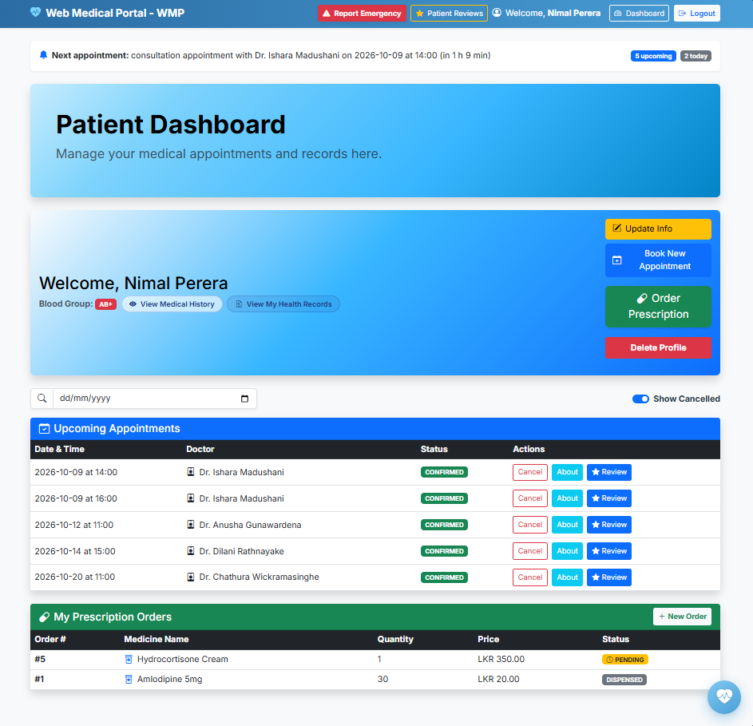
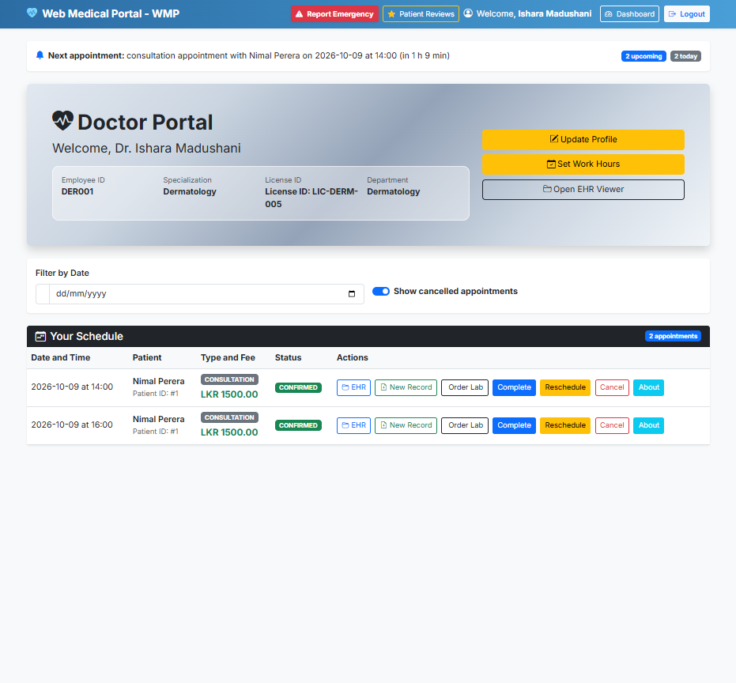
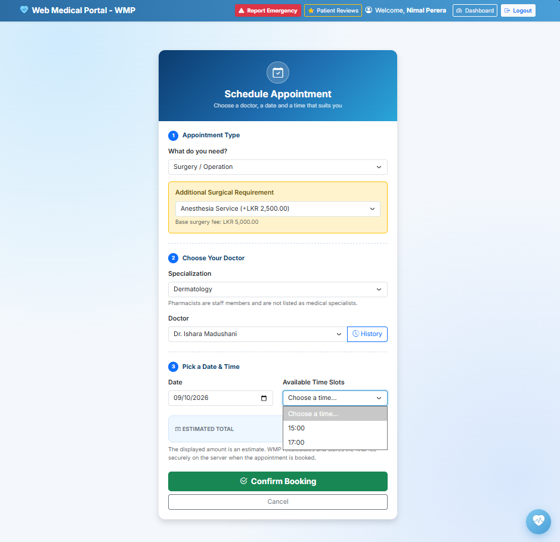
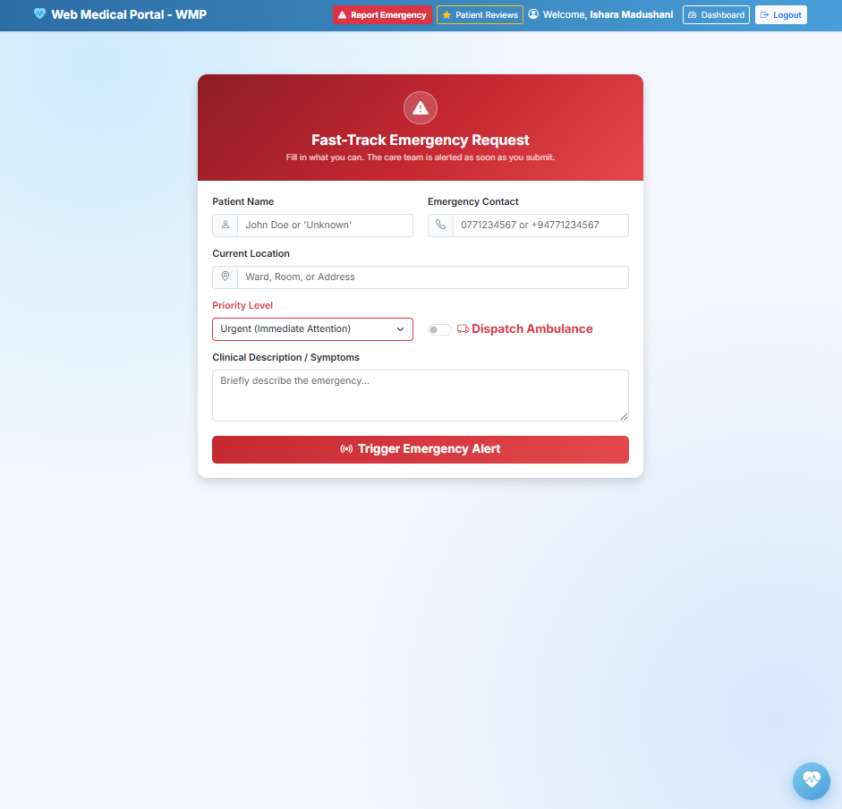

# Web Medical Portal – WMP 🏥

A role-based hospital management web application built with **Spring Boot, Spring MVC and JSP**. It connects patients, doctors, pharmacists, lab technicians and administrators in one place: appointments, health records, prescriptions, lab work and emergency requests.

> Group project for **SE2030 – Software Engineering** (Year 2, Semester 1, 2026), Sri Lanka Institute of Information Technology. Group ID: `2026-Y2-S1-MLB-B3G1-07`. The proposal report refers to the system as *LankaCare*.


## 📸 Screenshots

| Patient dashboard | Doctor dashboard |
|---|---|
|  |  |

| Booking an appointment | Emergency request |
|---|---|
|  |  |

## ✨ Features

### Six user roles
Patients, doctors, hospital administrators, pharmacists, lab technicians and system administrators each get their own dashboard. Access is checked against the logged-in user's role on every protected route.

### Core modules
| Module | What it does |
|---|---|
| **Appointments & scheduling** | Patients book by specialization, doctor, date and time. Available slots are generated from each doctor's weekly work hours and loaded asynchronously with `fetch`. Doctors and patients can accept, reschedule or cancel. Surgeries add itemised extra charges, and the fee is recalculated on the server. |
| **Clinical operations** | EHR viewer and record forms, treatment plans, and a teleconsultation room for doctors. |
| **E-prescribing & pharmacy** | Prescription orders flow to the pharmacist, who marks them ready, dispensed or cancelled. |
| **Laboratory & diagnostics** | Doctors order tests, and technicians track the sample pipeline and enter results. |
| **Emergency & care coordination** | A fast-track emergency request form open to everyone, with priority levels, ambulance dispatch and live polling on the emergency dashboard. |
| **AI health assistant** | A chat assistant widget available across the portal. |
| **Patient reviews** | Patients review doctors after appointments, and public reviews are shown in a popup. |

### 🔔 In-app appointment reminders
A background job creates reminders for both **patients and doctors**, which appear as a summary banner and dismissible alerts on each dashboard.

- Runs every 5 minutes with Spring's `@Scheduled` (`AppointmentReminderService`).
- Sends a **24-hour** reminder and a **1-hour** reminder for each *confirmed* appointment.
- Reminders are stored once per person, appointment and time in a `notifications` table, so re-runs never duplicate them.
- A reminder disappears automatically if the appointment is cancelled, rescheduled or already past.
- The banner shows the next appointment, how many are upcoming and how many are today, and refreshes every minute without a page reload.

### 🔒 Security touches
- Session-based login with role checks in the controllers.
- Cache-control headers on dashboards so sensitive pages are not shown from the browser cache after logout.
- Output escaping with `<c:out>` for user-supplied text such as names and reviews.
- Parameterised SQL through `JdbcTemplate` throughout.
- Appointment audit trail: when an appointment is confirmed, a record is also appended to a flat file through `ApptFileService`. This file feeds the patient's billing history for each doctor.

## 🛠️ Tech stack

| Layer | Technology |
|---|---|
| Backend | Java 17+, Spring Boot 3.x, Spring MVC |
| Data access | Spring JDBC (`JdbcTemplate`, custom `RowMapper`s) |
| Database | MySQL |
| Views | JSP + JSTL, HTML5, vanilla JavaScript |
| UI | Bootstrap 5, Bootstrap Icons, Inter font |
| Build | Maven |

## 🚀 Getting started

### Prerequisites
- Java 17 or higher
- Maven
- MySQL server running locally

### Installation
1. **Clone the repository**
   ```bash
   git clone https://github.com/IT25100984/Web_Medical_Portal_Demo.git
   cd Web_Medical_Portal_Demo
   ```

2. **Create the database** and load the schema script from the project, then run the reminder table script (`notifications.sql`, see [Database](#-database)).
   ```sql
   CREATE DATABASE medical_portal_db;
   ```

3. **Configure the connection** in `src/main/resources/application.properties`:
   ```properties
   spring.datasource.url=jdbc:mysql://localhost:3306/medical_portal_db
   spring.datasource.username=root
   spring.datasource.password=your_password
   ```

4. **Run the application**
   ```bash
   mvn clean install
   mvn spring-boot:run
   ```

5. **Open the portal** at <http://localhost:8080>.

## 🗄️ Database

Reminders use one table. The scheduler fills it automatically, so there is nothing to insert by hand.

```sql
CREATE TABLE IF NOT EXISTS notifications (
    notification_id INT AUTO_INCREMENT PRIMARY KEY,
    user_id         INT          NOT NULL,
    appointment_id  INT          NOT NULL,
    reminder_type   VARCHAR(10)  NOT NULL,   -- '24H' or '1H'
    appt_start      DATETIME     NOT NULL,
    message         VARCHAR(255) NOT NULL,
    is_read         BOOLEAN      NOT NULL DEFAULT FALSE,
    created_at      TIMESTAMP    NOT NULL DEFAULT CURRENT_TIMESTAMP,
    UNIQUE KEY uq_reminder (appointment_id, user_id, reminder_type, appt_start),
    KEY idx_notifications_user_unread (user_id, is_read),
    FOREIGN KEY (user_id) REFERENCES users(user_id) ON DELETE CASCADE,
    FOREIGN KEY (appointment_id) REFERENCES appointments(appointment_id) ON DELETE CASCADE
);
```

## 📂 Project structure

```
src/main/java/com/webmedicalportaldemo/
├── controller/   Request handling and role-based routing
├── dao/          JdbcTemplate data access (AppointmentDAO, NotificationDAO, ...)
├── dto/          Read models passed to views and JSON endpoints
├── model/        Domain classes (User, Doctor, Appointment, Consultation, Surgery, ...)
└── service/      Business logic, scheduling, file sync (AppointmentReminderService, ApptFileService)

JSP views
├── clinical/     Doctor dashboard, EHR, treatment plans, teleconsultation
├── emergency/    Emergency request, dashboard, polling script
├── lab/          Lab technician pages
├── patient/      Patient dashboard, appointment booking
├── pharmacy/     Pharmacist pages
├── shared/       Header, reviews popup, reminder banner
└── index.jsp, login.jsp, register.jsp
```

## 🔌 Reminder API

| Method | Endpoint | Purpose |
|---|---|---|
| `GET` | `/api/reminders` | Next appointment, upcoming and today counts, unread reminders for the logged-in doctor or patient |
| `POST` | `/api/reminders/{id}/read` | Dismiss one reminder |
| `POST` | `/api/reminders/read-all` | Dismiss all reminders |

## 🗺️ Roadmap

- [ ] Move manual session role checks to Spring Security (`@PreAuthorize`), with BCrypt hashing and session timeout.
- [ ] Email and SMS delivery for reminders, building on the in-app notifications.
- [ ] Automated tests for the DAOs and the reminder scheduler.
- [ ] Move business actions such as lab requests and emergency handling into dedicated REST controllers.
- [ ] Push notifications over WebSocket instead of polling.
- [ ] Waiting list and live queue positions for fully booked sessions.

## 👥 Team

| Member | Module |
|---|---|
| S. M. N. A. Karunarathne | AI Health Assistant & Patient Engagement |
| L. A. S. Wijesinghe | Appointment & Scheduling Management |
| P. Yaksika | Clinical Operations Management |
| V. R. W. Pathiratne | E-Prescribing & Pharmacy Management |
| H. C. N. Perera | Laboratory & Diagnostic Services |
| B. A. R. Fernando | Emergency & Care Coordination |

## ⚠️ Scope and limitations

This is an academic project. Billing uses simulated payments (no live payment gateway), there is no integration with medical devices, and video consultations are meant to use third-party links rather than a native video server. Healthcare information shown in the system does not replace professional medical advice.
